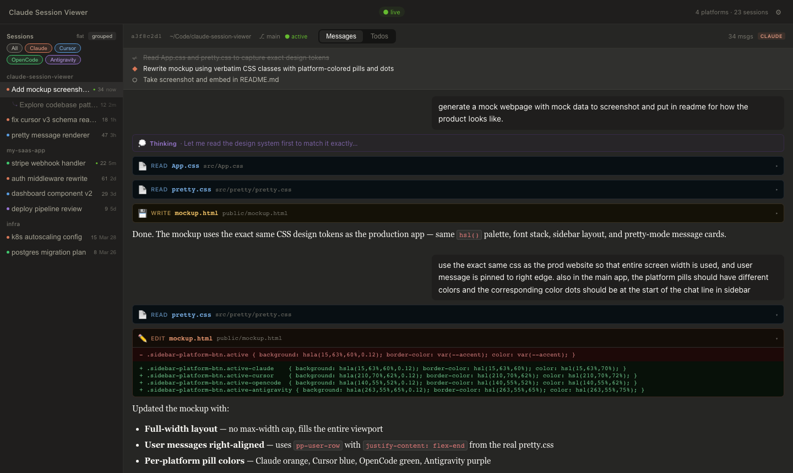

# Agent Session Viewer



A live multi-platform session viewer — browse AI coding assistant conversations across Claude Code, Codex, Cursor, OpenCode, Hermes, Antigravity, and messaging bots (nanoclaw, openclaw, picoclaw, and friends) in a unified dark-mode UI with markdown rendering, tool call cards, fuzzy thread search, and thinking blocks.

Sessions are streamed to a Cloudflare Worker (KV storage) by a local daemon that watches your session directories. Works on desktop and mobile.

**Static UI mockup** — [`public/mockup.html`](public/mockup.html) is a standalone offline snapshot of the layout. After `npm run dev`, open **`http://localhost:5173/mockup.html`**.

## Features

- **Live updates** — sessions appear as you work; SSE streaming keeps the UI current
- **Pretty mode** — markdown rendering, thinking pills, tool call cards (Bash, Read, Edit, Write, Search…)
- **Multi-platform** — Claude Code, Codex, Cursor, OpenCode, Hermes, and Antigravity sessions in one place
- **Platform filter** — filter the sidebar by platform
- **Sub-agent runs** — sub-agent sessions are visually distinguished with a `⤷ sub-agent` indicator and indented border
- **Flat or grouped sidebar** — all sessions sorted by last activity, or grouped by project
- **Session renaming** — give sessions memorable names via the pencil icon
- **Thread search** — fuzzy in-sidebar search across all sessions
- **Mobile-friendly** — slide-in sidebar drawer, back button, safe-area aware
- **PIN-protected** — simple cookie auth for remote access

## Platform support

All platforms are auto-detected from their standard locations — no configuration needed if the directories exist.

| Platform | Default location | Format |
|---|---|---|
| **Claude Code** | `~/.claude/projects/**/*.jsonl` | JSONL |
| **Codex** | `~/.codex/sessions/**/*.jsonl` | JSONL event stream |
| **Cursor** | `~/Library/Application Support/Cursor/User/globalStorage/state.vscdb` | SQLite |
| **OpenCode** | `~/.local/share/opencode/` | SQLite + JSON |
| **Hermes** | `~/.hermes/state.db` | SQLite |
| **Antigravity** | `~/.gemini/antigravity/brain/{uuid}/` | Markdown artifacts |

### Platform notes

**Codex** — rollout transcripts are read from `~/.codex/sessions/`. Structured `function_call` / `function_call_output` entries render as proper tool-use cards in Pretty mode.

**Cursor** — sessions are read from the SQLite blob store. Workspace → folder mapping is resolved via `workspaceStorage/`. macOS only (path is hardcoded to `~/Library/Application Support/Cursor/`).

**OpenCode** — reads from `~/.local/share/opencode/opencode.db` (newer releases) with fallback to the flat `storage/` directory layout.

**Antigravity** — Google's coding agent stores structured artifacts per session (`task.md`, `implementation_plan.md`, `walkthrough.md`). Each artifact is shown as an assistant message. Full conversation logs use an undisclosed protobuf schema and are not read.

**Hermes** — reads from `~/.hermes/state.db`. Sessions are grouped by source (Telegram channel, WhatsApp number, etc.).

## Claw bot integration

Agent Session Viewer supports **claw-type messaging bots** — AI agents that run via WhatsApp or Telegram and store session data locally.

Two storage layouts are supported automatically:

- **nanoclaw-style** (default): `{dir}/store/messages.db` + `{dir}/data/sessions/`
- **picoclaw-style**: `{dir}/workspace/sessions/` (JSONL directly, no SQLite DB)

Auto-detected from standard install locations (first match wins):

| Tool | Auto-detected at | Layout |
|---|---|---|
| **nanoclaw** | `~/nanoclaw` or `~/.nanoclaw` | nanoclaw-style |
| **openclaw** | `~/openclaw` or `~/.openclaw` | nanoclaw-style |
| **picoclaw** | `~/picoclaw` or `~/.picoclaw` | picoclaw-style |
| **femtoclaw** | `~/femtoclaw` or `~/.femtoclaw` | nanoclaw-style |
| **attoclaw** | `~/attoclaw` or `~/.attoclaw` | nanoclaw-style |
| **kiloclaw** | `~/kiloclaw` or `~/.kiloclaw` | nanoclaw-style |
| **megaclaw** | `~/megaclaw` or `~/.megaclaw` | nanoclaw-style |
| **zeroclaw** | `~/zeroclaw` or `~/.zeroclaw` | nanoclaw-style |
| **microclaw** | `~/microclaw` or `~/.microclaw` | nanoclaw-style |
| **rawclaw** | `~/rawclaw` or `~/.rawclaw` | nanoclaw-style |

If your installation is in a non-standard location, set the env var override (e.g. `NANOCLAW_DIR=/path/to/nanoclaw`) or configure the path in the Settings panel (⚙).

## Requirements

- Node.js ≥ 18
- A [Cloudflare account](https://dash.cloudflare.com/sign-up) (free tier is fine)
- `wrangler` CLI — installed automatically as a dev dependency

## One-command setup

```bash
git clone https://github.com/dhruv-anand-aintech/agent-session-viewer
cd agent-session-viewer
npm install
node setup.mjs
```

The setup script will:

1. Create a KV namespace in your Cloudflare account
2. Patch `wrangler.toml` with the real namespace IDs
3. Prompt you to choose a PIN
4. Build and deploy the Worker

After setup, the script prints your Worker URL and the exact command to start the daemon.

## Running the daemon

```bash
WORKER_URL=https://agent-session-viewer.<subdomain>.workers.dev \
AUTH_PIN=<your-pin> \
npm run daemon
```

Or with flags:

```bash
node daemon/watch.mjs --worker <url> --pin <pin>
```

The daemon does an initial sync of all existing sessions, then watches all supported platform directories for live changes. Claw tools are auto-detected — no flags needed if they're installed at standard locations.

## Local development (no Cloudflare)

```bash
npm run local         # local-server + Vite — reads all platform dirs directly
npm run local -- --host  # also bind to 0.0.0.0 for LAN access (mobile testing)
npm run dev           # Vite only (frontend only, no API)
```

`npm run local` reads all platform session directories directly — no daemon, no Cloudflare account, no KV needed.

## Deploying changes

```bash
npm run deploy
```

KV IDs are loaded from a `.env` file in the project root (created by `node setup.mjs`) or from environment variables:

```bash
# .env
SESSIONS_KV_ID=e61e79fc...
SESSIONS_KV_PREVIEW_ID=e5f103b9...
```

## Architecture

```
~/.claude/projects/**/*.jsonl           Claude Code sessions
~/.codex/sessions/**/*.jsonl            Codex sessions
~/Library/.../Cursor/.../state.vscdb    Cursor sessions (macOS)
~/.local/share/opencode/                OpenCode sessions
~/.hermes/state.db                      Hermes sessions
~/.gemini/antigravity/brain/            Antigravity sessions
~/nanoclaw/store/messages.db            claw bot chat history (auto-detected)
~/nanoclaw/data/sessions/**/*.jsonl     claw bot agent sessions (auto-detected)
         │
         ▼
  daemon/watch.mjs        (local file watcher + SQLite poller)
         │  PUT /api/sync (X-Auth-Pin)
         ▼
  Cloudflare Worker       (worker/index.ts — KV storage)
         │  SSE /api/stream
         ▼
  Browser (React + Vite)  (src/)

  ── or local mode ──

  local-server.mjs        (reads platform dirs directly — no Cloudflare)
         │  SSE /api/stream
         ▼
  Browser (React + Vite)  (src/)
```

## Configuration reference

All platform directories are auto-detected. These variables are **overrides only** — only needed if your install is in a non-standard location.

| Variable | Description |
|---|---|
| `WORKER_URL` | URL of your deployed Cloudflare Worker |
| `AUTH_PIN` | PIN set during `node setup.mjs` |
| `NANOCLAW_DIR` | Path to nanoclaw if not at `~/nanoclaw` |
| `OPENCLAW_DIR` | Path to openclaw if not at `~/openclaw` |
| `PICOCLAW_DIR` | Path to picoclaw if not at `~/picoclaw` |
| `{NAME}_DIR` | Override for any other claw tool |
