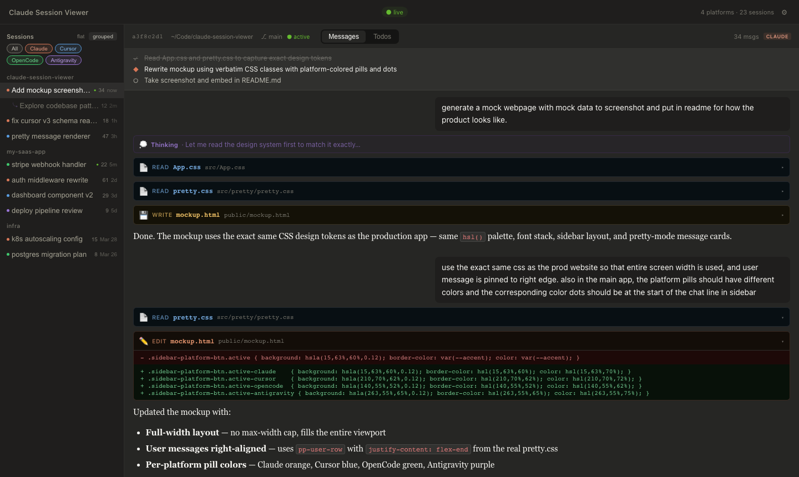

# Agent Session Viewer



A live multi-platform session viewer — browse AI coding assistant conversations across Claude Code, Codex, Cursor, OpenCode, Hermes, Antigravity, and messaging bots (nanoclaw, openclaw, picoclaw, and friends) in a unified dark-mode UI with markdown rendering, tool call cards, fuzzy thread search, and thinking blocks.

The hosted viewer at `agent-session-viewer.ainorthstar.tech` includes a public landing page, Google sign-in, and guided macOS setup. The native companion installs a per-user LaunchAgent that syncs in the background; it uses the local ASV API when available and reads recent Claude Code and Codex transcripts directly when the local viewer is closed.

## Install

### npx (no install required)

```bash
npx agent-session-viewer@latest
```

Downloads and runs directly. Builds the sidebar cache on first run, then opens at **http://localhost:3001**.

```bash
npx agent-session-viewer@latest --lan         # LAN access (phone, tablet)
npx agent-session-viewer@latest --ngrok       # permanent internet URL via ngrok
npx agent-session-viewer@latest --open        # auto-open browser
npx agent-session-viewer@latest --port 4000
npx agent-session-viewer@latest --skip-cache  # skip cache build
```

### Homebrew (macOS)

```bash
brew tap dhruv-anand-aintech/tap
brew install agent-session-viewer
agent-session-viewer
```

### From source

```bash
git clone https://github.com/dhruv-anand-aintech/agent-session-viewer
cd agent-session-viewer
npm install
npm run setup    # detects platforms, builds sidebar cache
npm run local    # starts at http://localhost:5173
```

To access from other devices on your network:

```bash
npm run local -- --lan
```

## Features

- **Multi-platform** — Claude Code, Codex, Cursor, OpenCode, Hermes, Antigravity, and claw bots in one place, all auto-detected
- **Live updates** — sessions appear as you work; SSE streaming keeps the UI current
- **Pretty mode** — markdown rendering, thinking pills, tool call cards (Bash, Read, Edit, Write, Search…)
- **Platform filter** — filter the sidebar by platform
- **Sub-agent runs** — sub-agent sessions are visually distinguished with a `⤷ sub-agent` indicator and indented border
- **Flat or grouped sidebar** — all sessions sorted by last activity, or grouped by project
- **Session renaming** — give sessions memorable names via the pencil icon
- **Thread search** — fuzzy in-sidebar search across all sessions
- **Agent Console** — chat with the selected transcript as context through `agl`, with provider/agent/mode switching
- **Mobile-friendly** — slide-in sidebar drawer, back button, safe-area aware
- **PIN-protected** — simple cookie auth for remote access
- **Optional rate-limit alerts** — a separate machine runner tails new transcript lines/files and shows persistent macOS applet alerts when a coding agent hits a usage limit

## Platform support

All platforms are auto-detected from their standard locations — no configuration needed if the directories exist.

| Platform | Default location | Format |
|---|---|---|
| **Claude Code** | `~/.claude/projects/**/*.jsonl` | JSONL |
| **Codex** | `~/.codex/sessions/**/*.jsonl` | JSONL event stream |
| **Cursor** | `~/Library/Application Support/Cursor/User/globalStorage/state.vscdb` | SQLite |
| **Gemini CLI** | `~/.gemini/tmp/**/chats/*.jsonl` | JSONL |
| **OpenCode** | `~/.local/share/opencode/` | SQLite + JSON |
| **Hermes** | `~/.hermes/state.db` | SQLite |
| **Antigravity** | `~/.gemini/antigravity/brain/{uuid}/` | Markdown artifacts |

### Platform notes

**Codex** — rollout transcripts are read from `~/.codex/sessions/`. Structured `function_call` / `function_call_output` entries render as proper tool-use cards in Pretty mode.

**Claude Code remote control** — claude.ai/code remote-control sessions use web ids like `session_...`, while local Claude Code JSONLs record the related bridge id as `bridgeSessionId: "cse_..."`. If claude.ai accumulates empty auto-created remote-control sessions, the safe cleanup rule is: preserve any `cse_...` bridge id that appears in local JSONLs with real user/assistant records or non-zero bridge sequence data; only delete remote rows without a protected local bridge id. The web `user_message_count` field can be wrong, so do not use it as the only signal for content.

**Cursor** — sessions are read from the SQLite blob store. Workspace → folder mapping is resolved via `workspaceStorage/`. macOS only (path is hardcoded to `~/Library/Application Support/Cursor/`).

**OpenCode** — reads from `~/.local/share/opencode/opencode.db` (newer releases) with fallback to the flat `storage/` directory layout.

**Gemini CLI** — chat transcripts are read from per-workspace folders under `~/.gemini/tmp/*/chats/`.

**Antigravity** — Google's coding agent stores structured artifacts per session (`task.md`, `implementation_plan.md`, `walkthrough.md`). Each artifact is shown as an assistant message. Full conversation logs use an undisclosed protobuf schema and are not read.

**Hermes** — reads from `~/.hermes/state.db`. Sessions are grouped by source (Telegram channel, WhatsApp number, etc.).

## Optional rate-limit alerts

The rate-limit alert system is intentionally separate from the web app. It installs a user LaunchAgent that tails newly-written transcript lines and newly-created transcript files for Claude Code, Codex, Cursor, Gemini CLI, OpenCode, Hermes, OpenClaw, and related claw agents.

```bash
npm run rate-limit-watch:launchd-install
```

If installed from npm or Homebrew, the same global command is available:

```bash
agent-session-viewer-rate-limit-install
```

The installer copies the runner into `~/.config/agent-session-viewer/rate-limit/`, so it does not depend on the current repo checkout after installation. Runtime cursors are stored under `~/.local/state/agent-session-viewer-rate-limit/`; alert/app scheduling state is stored under `~/.local/state/agent-rate-limit-alarm/`.

Disable alerts from the Settings panel or by setting:

```bash
AGENT_SESSION_VIEWER_RATE_LIMIT_ALERTS=0
```

To remove the LaunchAgent and copied runner:

```bash
npm run rate-limit-watch:launchd-uninstall
# or: agent-session-viewer-rate-limit-uninstall
```

## Claw bot integration

Agent Session Viewer supports **claw-type messaging bots** — AI agents that run via WhatsApp or Telegram and store session data locally.

Two storage layouts are supported automatically:

- **nanoclaw-style** (default): `{dir}/store/messages.db` + `{dir}/data/sessions/`
- **picoclaw-style**: `{dir}/workspace/sessions/` (JSONL directly, no SQLite DB)

Auto-detected from `~/toolname` or `~/.toolname` for each of: nanoclaw, openclaw, picoclaw, femtoclaw, attoclaw, kiloclaw, megaclaw, zeroclaw, microclaw, rawclaw.

If your installation is in a non-standard location, configure the path in the Settings panel (⚙) or set `{NAME}_DIR` as an env var override.

## Remote access

The CLI includes built-in sharing options — no cloud account needed:

```bash
npx agent-session-viewer@latest --ngrok    # permanent URL via ngrok (free account required)
npx agent-session-viewer@latest --lan      # local network only (same WiFi)
```

Or omit flags to get an interactive menu at startup.

## Agent Console providers

The Agent Console uses `agl` locally by default:

```bash
agl --help
npm run local
```

Open a session, click **Agent**, choose a provider/agent/mode, and send a message. The UI sends the active transcript context to `/api/agent/chat`; the server hides the translated backend command.

Additional HTTP providers can be added with:

```bash
export AGENT_SESSION_AGENT_PROVIDERS_JSON='{"providers":[{"id":"modal","label":"Modal","kind":"cloud-http","endpoint":"https://example.com/api/agent/chat","agents":["codex"]}]}'
```

## Cloudflare Worker and tunnel mode

The Worker can serve the web UI and route `/api/agent/*` to one of three execution surfaces:

- `local` — proxies to `LOCAL_AGENT_BASE_URL`, usually a Cloudflare Tunnel pointing at the local `npm run local` server.
- `worker-js` — runs in the Worker runtime and is intended only for lightweight JavaScript agents.
- `cloud-http` — proxies to providers configured in `AGENT_PROVIDER_CONFIG`.

Build and run the Worker locally:

```bash
npm run build
npx wrangler dev
```

For a deployed Worker URL on a Cloudflare-managed hostname, use a Wrangler `[[routes]]` entry with `custom_domain = true`, so Cloudflare manages DNS and SSL for the active zone. The zone must already be active on Cloudflare nameservers.

For Google-login cloud mode, per-user machine tokens, R2 transcript storage, command polling, and GCP `e2-micro` runner setup, see [`docs/cloud-mode.md`](docs/cloud-mode.md).

## Other commands

```bash
npm run build-cache   # rebuild sidebar cache manually (runs automatically during setup)
npm run dev           # Vite frontend only, no API
npm run build         # production build
npm run lint          # eslint
```

## Architecture

```
~/.claude/projects/**/*.jsonl           Claude Code sessions
~/.codex/sessions/**/*.jsonl            Codex sessions
~/Library/.../Cursor/.../state.vscdb    Cursor sessions (macOS)
~/.local/share/opencode/                OpenCode sessions
~/.hermes/state.db                      Hermes sessions
~/.gemini/antigravity/brain/            Antigravity sessions
~/nanoclaw/store/messages.db            claw bot chat history (auto-detected)
~/nanoclaw/data/sessions/**/*.jsonl     claw bot agent sessions (auto-detected)
         │
         ▼
  local-server.mjs        (reads platform dirs directly)
         │  SSE /api/stream
         ▼
  Browser (React + Vite)  (src/)
         │
  bin/agent-session-viewer.mjs  (CLI: TUI menu, LAN/ngrok sharing)
```
